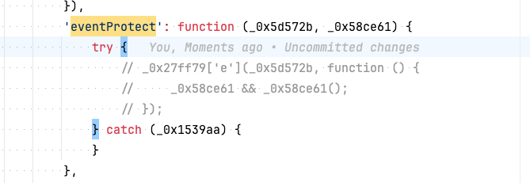
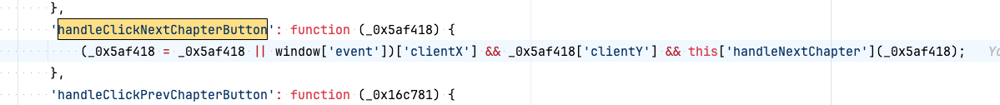
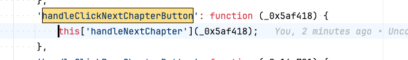

# wrx 魏如雪

## 8.js修改内容 (现在被替换成了6.js了)
1. `eventProtect`方法注释掉如下内容:
   

2. 下面这4个方法去掉坐标大小的判断
- `handleClickNextChapterButton`
- `handleClickPrevChapterButton`
- `handleClickPrevSectionButton`
- `handleClickNextSectionButton`

替换前：

替换后：

最终结果：

## 以上修改可以通过执行`yarn transform`脚本进行处理。
