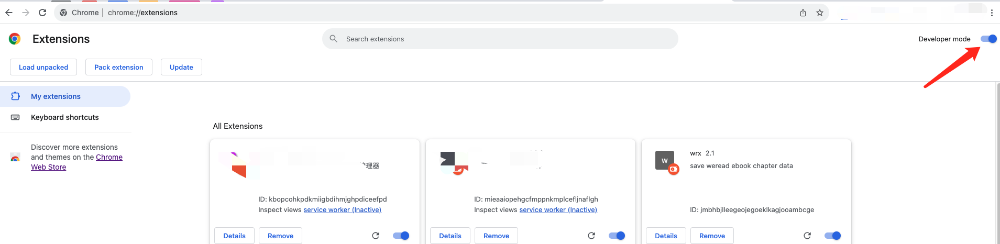
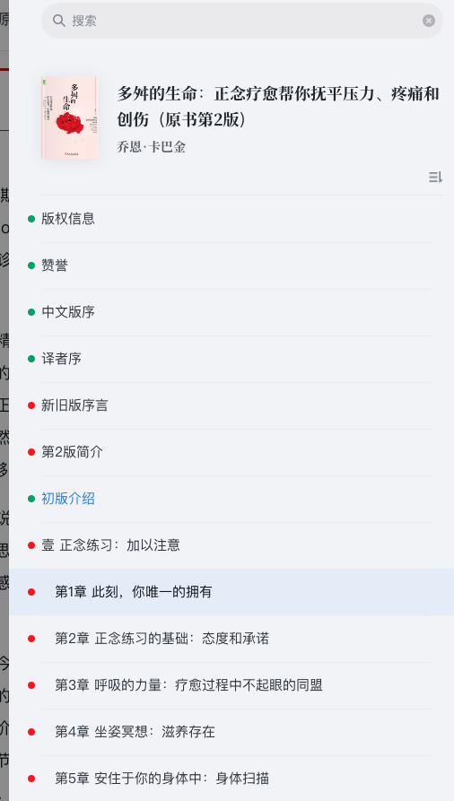
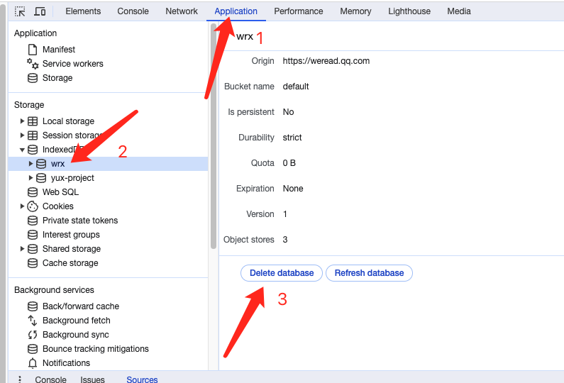

# wrx 魏如雪

一套电子书导出工具，由【采集端([chrome插件](https://github.com/ckcock/wrx/releases))】和【解密端([在线网站](https://ebook-exporter.deno.dev))】两个组件构成，支持导出 HTML 和 EPUB 两种格式。本项目为**采集端**，**解密端**暂时没有开源。

## 相关说明
本套工具为电子书导出工具，导出的内容为你在电子书阅读网站上真正阅读过的内容，通过 **缓存 + 解密** 技术生成相关书籍的 HTML / EPUB 版本的电子书。

因此，对于那些需要 vip 才能阅读的内容，如果你没有相关 vip 权益而无法阅读相关内容，则本工具也无能为力。

## 支持的电子书平台

- [微信读书](https://weread.qq.com/)
- [知乎书店](https://www.zhihu.com/pub) 进度可以查看[接入知乎](docs/sites/zhihu.md)

> [!WARNING]
> 根据部分用户的反馈，在微信读书平台使用该插件有封号风险，请酌情使用。如果有小号的，尽量用小号使用该插件。  
> 【解密端】的使用不存在风险，请放心使用。

## 安装
从 [Release 页面](https://github.com/ckcock/wrx/releases)下载最新版本的 wrx.zip 并解压，然后打开 Chrome 插件管理页面(chrome://extensions/)，如下：

开启右上角的开发者模式，然后通过左上角的【Load unpacked】按钮安装这个 **wrx** 插件。

## 使用

打开微信读书阅读页面，打开目录弹框，你需要把这些红点点都点成绿色的，如下所示：

## 数据导出

在阅读页面的右上角，点击【导出本书数据】按钮，即可将已缓存的数据导出(此数据是加密数据，需要使用 https://ebook-exporter.deno.dev 进行解密)。

## 插件更新

该程序由 Github Actions 自动构建，通过 schedule 每个小时执行一次检测，如果发现微读web版有更新，会自动开始新的构建并发布新版本。
当插件有新版本时，需要重新按照上面的【安装】指南进行安装。

## 数据清理

如果担心该插件缓存的数据占用太多空间，或者仅仅是想知道怎么清除这些缓存的数据，那么可以打开浏览器的控制台，按照如下操作删除 **IndexedDB** 下面的 **wrx** 数据库即可：

## 常见问题

### 1. 自动翻页功能失效了，我该怎么办？
插件中内置的自动翻页功能是通过修改源网站相关js实现的，如果源网站相关js更新了，则会导致该功能失效。

不过你不用担心，程序会通过 Github Actions 的定时器每隔1个小时去检查相关文件是否有更新，然后通过自动打补丁的方式发布新版本。

通常你只需要检查该仓库是否有发布新的版本，并用新版本替换即可。

### 2. 为什么不发布到插件市场，然后自动更新？而采用这种手动更新的“笨拙”方式？
由于上面说的原因，该插件中需要包含源网站的相关js文件，而该js文件通常是经过混淆的，但是 chrome 的插件市场不能发布带有混淆代码的插件，所以无法发布到 chrome 的插件市场。
