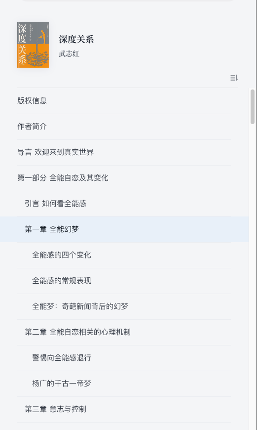
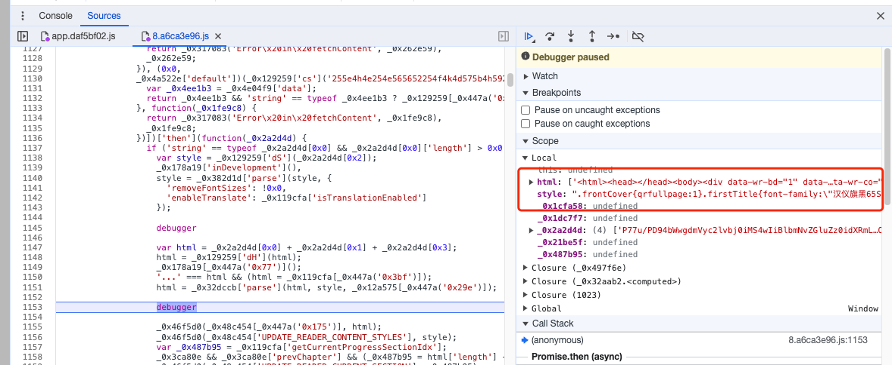

# 实现原理

微信读书里面的书大概分2类: epub 和 txt，另外还有一种 pdf 格式的比较特殊，后面单独说明。

每本书都是按照章节进行阅读和下载的，比如下面这本书的目录：



每一行都是一个章节，总的章节数据可以通过下面这个接口获取：
```http request
POST /web/book/publicchapterInfos
Host: https://weread.qq.com
Content-Type: application/json;charset=UTF-8

{"bookIds":["3300076204"]}
```
返回的 json 里面，`data.updated`字段即章节数组，比如第一章：
```json
{
  "chapterUid": 1,
  "chapterIdx": 1,
  "updateTime": 1698825146,
  "tar": "https://res.weread.qq.com/wrco/tar_CB_3300076204_1",
  "title": "封面",
  "wordCount": 2,
  "price": 0,
  "isMPChapter": 0,
  "level": 1,
  "files": [
    "Text/coverpage.xhtml"
  ]
}
```

> 注意里面有一个`tar`字段，是指向一个文件，打包了这一章里面的所有图片资源。
> 这个`tar`包文件的下载，是需要登录信息的。

第一章通常是封面，但是一般不显示在 web 版的目录里面，这一章的图片资源通常只有一张，也就是封面图。

有的章节比较特殊，比如下面这个：
```json
{
  "chapterUid": 5,
  "chapterIdx": 5,
  "updateTime": 1698825146,
  "tar": "",
  "title": "第一部分 全能自恋及其变化",
  "wordCount": 761,
  "price": 0,
  "isMPChapter": 0,
  "level": 1,
  "files": [
    "Text/chaper003.xhtml"
  ],
  "anchors": [
    {
      "title": "引言 如何看全能感",
      "anchor": "sigil_toc_id_1",
      "level": 2
    }
  ]
}
```
内部有一个`anchors`数组，这个数组里面的部分也属于目录的一部分，但是却没有单独的`chapterUid`等信息，也就是说，同一章节里面包含了多条目录数据。

有了目录数据，我们就可以用下载接口下载章节数据了。

不同格式的书需要用不同接口进行下载，其中`epub`格式的书下载接口如下：
```
https://weread.qq.com/web/book/chapter/e_0 (html 片段)
https://weread.qq.com/web/book/chapter/e_1 (html 片段)
https://weread.qq.com/web/book/chapter/e_2 (style)
https://weread.qq.com/web/book/chapter/e_3 (html 片段)
```
`txt`格式的书的下载接口如下：
```
https://weread.qq.com/web/book/chapter/t_0 (text 片段)
https://weread.qq.com/web/book/chapter/t_1 (text 片段)
```

每一本`epub`格式的书的章节都分成了 4 部分，其中 0、1、3 是`html`片段，下载完之后需要拼起来才是完整的`html`数据，2 是`style`。
`txt`格式的书分2个部分，都是`html`数据，没有样式。

每一章的下载参数如下：
```json5
{
  "b": "bb432f60813ab8444g014d61", // bookId 的编码值
  "c": "ecc32f3013eccbc87e4b62e", // chapterUid 的编码值
  "r": 97344, // 随机数
  "st": 0, // 0表示html，1表示style
  "ct": 1699415043, // 当前时间戳
  "ps": "57d32ab07a2119e6g017bd2", // 打开这本书时服务端时间戳的编码值
  "pc": "a8f324b07a2119e7g017cec", // 打开这本书时客户端时间戳的编码值
  "sc": 0,
  "prevChapter": false, // 是否是点击顶部的"上一章"按钮进行获取的
  "s": "d97170d6" // 以上这些数据的签名
}
```

下载的数据是加密的，经过解密拼接之后，就是这个章节的 html 文档和 style 样式了，如下图所示：


通过遍历章节列表，把所有的章节数据都下载下来，我们把 style 部分内嵌到 html 中，这样每一个章节都是一个单独的 html 文档，然后我们再把 html 文档合并成一个 html 文档，这就是下载 html 格式的原理。
我们把 html 格式里面的图片单独下载下来，然后替换图片的 src 属性，并把所有内容打包到 epub 里面，这就是下载 epub 格式的原理。
